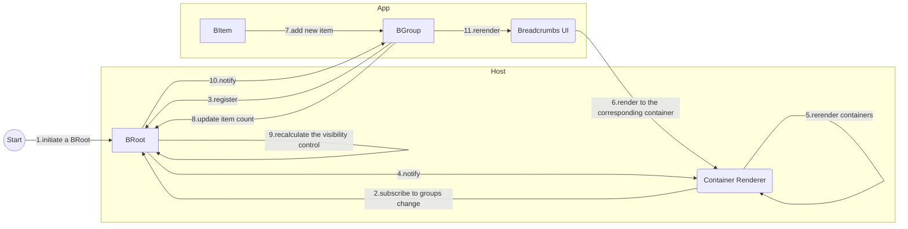

# Nested Breadcrumbs

This demo demonstrates one approach to implementing breadcrumbs in a **multi-router micro-frontend** architecture.

In a typical single-router application, breadcrumbs are straightforward, they’re essentially a subset of the route hierarchy. You simply get the matched routes, map them to human-readable text, and handle i18n or state updates like any other UI component.

However, in a **multi-router micro-frontend** setup, things change. You can’t assume that every micro-frontend shares the same routing library, UI framework, or data-fetching approach, and even if they use the same libraries, their versions may differ.

## Key components

To address this challenge, the solution is built around three core concepts:

- **BRoot** - The breadcrumb root. Handles registration of `BGroup` instances and notifies listeners when key state changes.
- **BGroup** - A breadcrumb group. Manages the registration of `BItem` instances and syncs its item count back to `BRoot`.
- **BItem** - A breadcrumb item. Represents a visible text label or clickable link, typically mapping directly to a UI component.

## Protocol steps



# Setup

Install the dependencies:

```bash
pnpm install
```

## Get started

Start the dev server, and the app will be available at [http://localhost:3000](http://localhost:3000).

```bash
pnpm dev
```

Build the app for production:

```bash
pnpm build
```

Preview the production build locally:

```bash
pnpm preview
```
